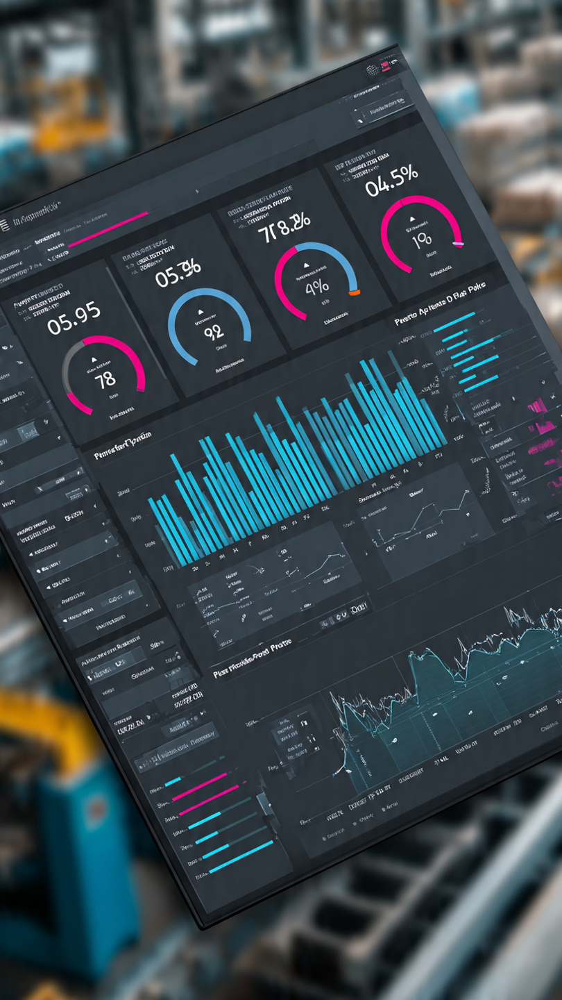

# Dashboard OEE - Indústria 4.0 | Toronto

**Setor:** Manufatura / Automotiva  
**Objetivo:** Monitorar Overall Equipment Effectiveness em tempo real para fábricas de Ontario

**KPIs Principais:**
- OEE % = Disponibilidade × Performance × Qualidade
- Downtime por máquina e turno
- MTBF / MTTR 
- Custo de Parada em CAD$

**Tecnologias Power BI:**
- **DAX:** CALCULATE, FILTER, DIVIDE, VAR, Time Intelligence
- **Power Query:** Conexão SQL Server + SAP
- **Visuais:** KPI Card, Gráfico Waterfall, Gauge, Matrix
- **Recursos:** Drill-through, Bookmarks, Row-Level Security

**Destaque Canadá:** Métricas Lean Manufacturing exigidas em Toronto. 
**Status:** Em desenvolvimento - Print e .pbix serão adicionados em breve.

